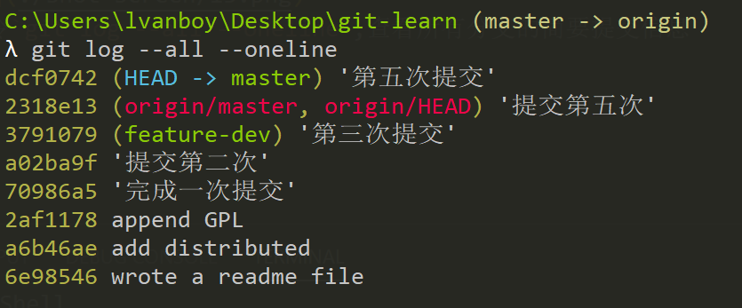
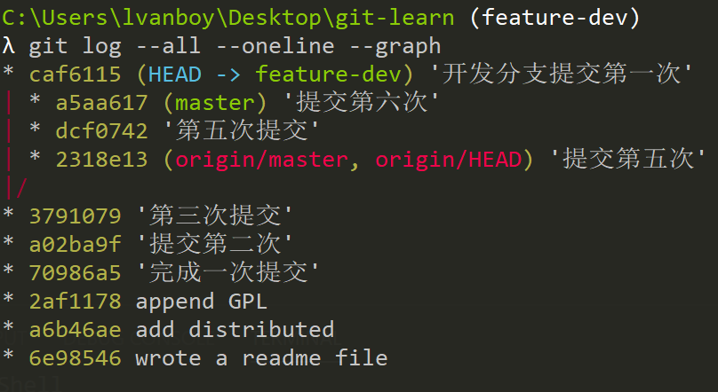
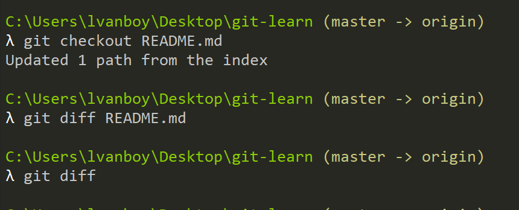

# Git从入门到入迷

## 配置user信息包括user.name和user.email

```
    git config --global user.name 'yourName'
    git config --global user.email 'yourEmail'
```

配置这两个信息，在多人协作中，Name是用于标注代码是谁提交的，Email在code_review时用于邮件通知。

## config的三个作用包括--local，--global，--system

- --local 当前身份只对某个仓库生效，对于公司的项目，公司给你身份时xxx，个人项目随心所欲的使用名称xsxs。
- --global 当前身份对所有的仓库有效，不论个人还是公司项目使用统一的身份。
- --system 对系统所有登录用户有效，对于服务器类别的电脑，电脑的使用者可能不止一个人，别人也能通过账号密码登录到这台电脑，此时他的项目如果提交之前，应该设置自己信息，如果其他使用这个电脑的人配置了这台git的信息，那么当你在提交代码的时候，显示的则是别人设置的信息。

## 显示config的配置

```
    git config --list --local
    git config --list --global
    git config --list --system
```

为了避免发生一些提交信息不正确，使用--list查看config配置了哪些信息。


## 建立Git仓库

你当前的项目可能是以下情景的一种或者三种。
1. 新建一个git仓库，使用命令`git init projectName`，此时会创建projectName的文件夹，该文件夹中还会生成一个隐藏文件.git,用于存放git的版本信息。
2. 本地已有项目，但未使用git管理，进入项目根目录，使用命令`git init`，和第一种情况一样，会生成.git的隐藏文件夹。
3. 从git的远程托管平台git clone xxx,，进入项目，直接进行git操作即可。

假设已有git项目分别为git-learn，使用命令配置一个`--global`的git身份。

```
git config --global user.name lvanboy
git config --global user.email 1801996111@qq.com
```

进入项目git-learn，查看`git config --list --global`。


再使用命令`git config --local user.name ajpjiang`配置当前项目的git信息，使用`git config --list --local`查看，验证是否会覆盖`--global`的git配置。


显示，`--local`和`--global`他们都是独立的空间，并不会发生覆盖的现象

那么，最终提交的结果会使用哪种身份信息呢？

按照如下操作（如果忽略其中的步骤，操作会失败，并给出相应的操作提示）：

1. 使用git status 查看当前git项目是否有文件发生changes（修改、变更）,如果发生修改则显示，一些红色的文件标识了出来，很显眼。


2. 使用`git add [文件名|.]`，多数情况使用**.**通配符，添加所有变更文件到stage（暂存区|缓存），你可以不停的变更文件，然后add操作，都会不再git上留有记录，也就是说，你无法找回前n次修改的内容。再次`git status`查看项目文件状态
，一些绿色的文件表示了出来，也很显眼。


3. 使用`git commit -m'提交'`,将文件提交，一旦提交，档案成立，你可以commit多次，这些记录一直都在，`-m`描述当前提交是做了什么事情，变更了功能，修复什么bug、添加哪些文档等等，everything is ok.这些记录一直都你的电脑硬盘上。


4. 使用命令`git log`,查看。


这里有两次commit记录，有提交的时间，配置的git信息，提交时的描述，这里Author，最新的一次记录是ajpjiang，也就是--local生效了，而--global没有生效。

**由此得出结论在提交记录的时候，--local配置的信息大于--global。**


## git add 暂存区的意义

假设有这样一个场景，实现xxx需求，`git status`,`git add .`后，发现这个写法不够好，代码质量太低，想把所有add的内容全部撤销，回到初始状态，放弃之前编辑的代码，也就是当前commit时的代码状态，使用命令`git --rest --hard`。慎重使用，别把自己一天的成果reset了。


 ## git 文件/文件夹 重命名

1. 在本地修改文件或文件夹后，执行git status后，如图：


2. 如果你没有按照提示操作，直接`git add .`,`git commit -m'xxxx'`,你的记录将会出现添加文件，和删除文件的记录，而实际上你只是进行重命名的操作。正确的做法应该按照提示操作。

```
git add 修改后的文件名
git rm 修改前的文件名
```


3. 上面操作过于麻烦，最快的做法是git mv 当前文件名  期望修改的文件名(如果你只是因语义问题，期望改变文件名称时，你应该这样做)。


## git log 查询版本演变历史

1. 直接执行`git log`，显示git提交的详细信息。


2. 为了更清晰的显示主要提交做了什么，省略其他额外的不必要的信息，命令`git log --oneline`。


3. 如果这个项目提交了好几百次，你只期望查看最近的3（或者任意次）次提交记录，命令`git log -n5 --oneline`。


4. 假设不止一个分支，为了满足这个条件，使用命令`git checkout -b [BranchName] [CommitID]`,创建一个分支。


使用命令`git log --all --oneline`,查看所有分支的简要提交信息。



使用命令`git log --all --oneline --graph`,以图形分叉的方式展示出分支克隆的关系,因为当前只是创建了一个分支，并没有在当前分支上进行修改和提交，最左侧展示了一条直线。


修改feature-dev分支，并提交一次，在使用命令`git log --all --oneline --graph`查看。



使用命令`git log --oneline feature-dev`，只查看feature-dev分支的简要提交记录。


当然git log 的参数形式远不如此，可以使用命令`git help --web log`查看。

`gitk`命令可以直接召唤出图形界面

## 探秘.git 文件夹

首先进入到.git目录，使用命令`cat HEAD`,查看。


上图表明，当前的git工作区在master分支上，如果使用`git checkout [BranchName]`,切换分支feature，那么HEAD一定指向feature；接着，使用命令`cat config`，查看config中设置哪些内容。


使用vim编辑config内容，添加email信息，`git config --local user.email`,查看在config中添加的信息，是否已经生效。

 

也就是说，通过config命令配置的信息都是存储在.git/config文件中的；进入refs目录，发现下面有heads、remote、tags这三个文件，heads是存放分支的，外部的HEAD是指向heads文件夹的一个分支的，tags是项目里程碑的标注作用，remote存放远程分支。


进入heads目录，读取master分支，发现里面存放着一串数字，这个数字有点眼熟，在验证这个文件的类型`git cat-file master -t`，是一个commit，所以这个master是指向一个commit的引用的。


git目录中核心就是objects文件，进入objects文件夹，发现很多2位数字字母名称的文件夹，里面的内容也是一个hash串,将文件夹的名称和文件的名称concat在一起就是一个完整的hash，查看这个hash的类型，它可能是一个blob，还有可能是一个tree，tree里面包含多个blob，blob对应一个具体的文件夹,commitID存放的就是tree和blob。在`git add`过程中创建blob对象，`git commit`的过程中创建commit对象、tree对象、blob对象。


问：如果项目中存在一个文件夹，且文件夹中只有一个文件，那么.git/objects中会产生多少对象，分别存放的是什么？
答案是4个对象，分别的是commit tree blob tree和blob关系的对象。


## 分离头指针

1. 什么样的git操作会出现分离头指针？

使用命令`git checkout [commitID]`。

2. 分离头指针会出现什么影响

分离头指针后，忍让可以继续编辑项目，但在提交时，会出现提示性操作，如果没有正确操作，直接提交了，那么git会把这个提交当作垃圾，间隔一段时间被清理掉,因为此时的commit没有和任何的分支绑定。

3. 正确的做法：在提交时将commit与分支绑定绑定，使用命令`git branch [NewBranchName] [CommitID]`。


## HEAD和Branch的关系

1. HEAD是指向一个Branch，Branch指向一个commit的。

例如基于master分支创建一个branch-test分支，命令`git checkout -b branch-test master`,如果当前所在分支为master，则master可以省略，此时HEAD则指向branch-test。


2. 在对比两次commit时，需要使用CommitID，使用命令`git diff id1 id2`,绿色的表示增加的，红色表示删除的。


3. 利用HEAD做commit的指代，HEAD指向最新的commit，使用命令`git diff HEAD id2`,两次的操作是一样的。


4. 根据HEAD指代的commit寻找它的父级commit，也就是上一次提交(或者上n次提交)，使用HEAD~1(n),对比文件时则可以使用`git diff HEAD HEAD~1`,(另外 **^** 代表父级，寻找父亲的父亲，则使用 **^^**)，所以一般使用 **~**更容易代表多级。


## Branch的相关操作

1. 查看当前所有分支，`git branch -av`。

2. 删除xxx分支，`git branch -d xxx`，当弹出unmerge的提示后，如果可以保证当前分支删除后没有任何影响，使用命令`git branch -D xxx`。


## 修改最新的commit的message

使用命令`git commit --amend`，会进入到一个配置文件中，第一行则是message，修改成期望的即可。


## 修改任意一次commit的message

使用命令`git rebase -i parentCommitID`,parentCommitID即需要变更的commitID的父ID，执行命令后，会进入交互式界面，根据下面命令的提示，编辑当前文件的命令，这里将`pick`修改`r`代表编辑当前commit的message，然后文件保存退出，系统会再次进入到一个文件中，这个文件就是期望修改的文件，直接编辑第一条messsage即可，编辑完成后，记得保存退出即可。下面则是完成的操作截图。


## 将多个连续commit合并成一个

使用命令`git rebase -i parentCommitID`，然后进入配置文件修改与保存。

1. 假设如下图，将红色框框内的commit合并成一个，那此时需要的parentCommitID为**21f1178**。


2. 执行`git rebase -i parentCommitID`,进入对应的配置文件，进行编辑，下方的记录是最新的，合并时，根据命令从下往上合并，具体操作：将需要合并的commit对应的命令`pick`修改为`s`,然后保存退出即可。


3. 进入到另外一个合并管理的配置文件，添加最新的合并message，同时也可以注释掉之前的message。保存退出即可。


4. 合并后的结果和预期一致。


## 将任意的commit合并

同理，使用命令`git rebase -i parentCommitID`，然后进入配置文件修改与保存。
1. 假设如图，合并红色框中不连续的commit，对应的 **parentCommitID** 为feda52d。


2. 执行`git rebase -i parentCommitID`，进入到配置文件中，将合并对象的commit的`pick`命令变为`s`，剪贴到被合并commit的下一行,保存退出即可。(发生commit合并冲突，手动解决冲突，然后`git add .`,`git rebase --continue`，合并的commit可能会有多个冲突，需要反复这样命令的过程，直到看到 **Successfully rebased** )。


3. 进入到另外一个合并管理的配置文件，添加最新的合并message，同时也可以注释掉之前的message。保存退出即可,再次查看commit记录，只会出现一个第八次提交的commit。


## 对比暂存区与HEAD的文件差异
1. 前提当前处于`git add`命令后的情景，也就是暂存区有变化的条件下，使用`git diff --cached`。


## 对比暂存区与工作区的文件差异

1. 使用`git status`，只是能检测到哪些文件发生了修改，具体文件内容哪些发生变化还不知道。还未`git add`的区域，成为工作区。
2. 提前当前一部分代码`git add`，一部分代码没有`git add`（这部分代码成为工作区的代码）,使用`git diff`对比整个项目修改了哪些文件代码，还未添加暂存区（或叫未被git 追踪），`git diff -- x1 `，对比x1文件的工作区与暂存区的差异。


## 恢复暂存区，与当前HEAD保持一直

使用命令`git reset HEAD`,可以理解为`git add`的反向操作，将所有暂存区的内容全部移除，此时就与HEAD保持一致了；
另外可以指定移除暂存区的特定文件`git reset HEAD -- [文件名1 文件2...]`。


## 将工作区恢复为暂存区

此时应该是这样的情景，对文件A的代码已经完成了封装，将它放置到暂存区，但是呢，你觉得这个方案不够好，于是呢，又在文件A中添加了另外一种方案，但是这个方案搞了半天也没有实现。但是项目需要测试，这时候就需要把工作区中文件A一些无用的操作恢复到暂存区中。





## 重置到某个commit提交记录

这种操作意味着在这个commitID后面提交的记录都会被清除，使用命令`git reset --hard [CommitID]`。


## 对比两个分支

对比分支（其实分支对应的就是最新一次的commitID），实际就是对比不能commit的差异；使用命令`git diff [BranchName] [BranchName1] -- [文件名]`,`-- 文件名`指定了对比的文件，不加此参数，则是对比所有文件。

 


## 删除一个文件

使用命令`git rm [文件名]`,此时暂存区和工作区的这个文件都会被删除。


## 保留当前开发内容，优先修复Bug
之前说过，工作区上已有的内容不期望保留，可以恢复到暂存区的状态。而现在是将手头的工作保存到一个临时区，此时的工作区就什么都没有了，这样就可去修复Bug了。Bug修复完提交后，接着再将临时区的内容拉出来继续之前的工作。

1. 假设现在工作区上已经写了200行代码了，将这些代码保存到临时区，使用`git stash`存储，存储完后，使用`git stash list`查看存储列表。

2. 查看当前的工作区的状态，是空的，可以做你优先想做的事情，比如测试提出Bug需要修复。


3. 将临时区的内容取出来，继续完成之前的操作，`git stash apply`，或者`git stash pop`，区别在于**apply**会保留临时区的存储记录，**pop**将临时区最近存储的记录弹出（当前的记录再临时区中就不存在了）。


## .gitignore
顾名思义，指定git忽略哪些文件或者文件夹，在这个配置文件下文件和文件名发生修改时，git是无感知的。但需要注意文件与文件夹的区别,例如有配置`test`在.gitignore配置文件中：假设git仓库中不存在文件夹的名字与文件相同的情况，**test**表示会忽略文件或者文件夹，而`test/`在.gitignore配置文件中，**test/**表示只会忽略文件夹，因为这个描述的更细致。若存在文件夹的名字与文件相同的情况，则优先忽略同名文件夹，如果期望文件被忽略就需要更加细致的描述该文件，如加上后缀名。


## git仓库的本地备份
1. 使用娅协议，过程不可见，将.git文件备份`git clone [Path] [Name]`,Path是现有git项目的本地路径，Name就是复制的名称。


2. 使用智能协议，过程展示传输进度信息等等，同样的命令`git clone [Path] [Name]`，关键在于Path本地路径前加上**file://**。


3. 添加一个远端地址，`git remote add [Name] [Path]`。


4. 查看远端地址，`git remote -v`


5. 新建1个分支，将这个分支push同步到本地的远端


## 使用公私密钥关联远程仓库
1. 查看密钥哦，`ls -al ~/.ssh`,id_rsa和id_rsa.pub就是私钥和密钥，如果没有，需要生成。


2. 使用命令`ssh-keygen -t rsa -b 4096 [Email]`,Email就是自己的邮箱地址。

3. 将公钥保存在github特定路径（settings > SSH and GPG keys > new ssh key > Key）的配置里。


4. 在本地配置远端项目的git地址`git remote add [repoName] [repoAdd]`，repoName自定义的项目名称，repoAdd，项目的git地址。在将本地的项目`git push [repoName] [-all]`到远程项目中时，使用本地的私钥和远程的公钥进行认证，省略账号密码的认证过程；其中 **-all 代表所有分支**  

5. 当远程与本地存在不一样时，需要先`git pull [repoName] `，这个命令相等于`git fetch [repoName]` and `git merge [repoName]/master`，本地的master主动与repoName远程仓库的主分支合并，如果merged过程中如果发生冲突，需要手动解决。另外如果merge报错：`fatal：refusing to merge unrelated histories`，这个报错的说明了独立的两棵树不能合并，可使用命令`git merge --allow-unrelated-histories [repoName]/master`。


## git本身的缺点
1. git无法帮助开发者寻找开源项目
2. 无法发布分享到公共平台上

## github的有点
1. 有助于协同工作
2. 有助于开源发展


## github搜索技巧
Repositories搜索技巧
1. 搜索特定日期范围通过`created:<2019-11-01`;
2. 默认的搜索是根据repo的名称和描述来匹配，通过`es6 in:readme`,表示搜索es6关键词出现在readme中的仓库。
3. 搜索特定stars数量通过`stars:>2000`。
4. 搜索特定编程语言通过`language:javascript`。

Code搜索技巧
在特定的文件中，搜索特定文字，通过`'after_script' + 'stage:deploy' filename:.gitlab-ci.yml`，表示在文件名为.gitlab-ci.yml中搜索包含'after_script'和'stage:deploy'这样的关键字。


[更多的搜索技巧点击这里](https://help.github.com/en/github/searching-for-information-on-github/searching-on-github)


